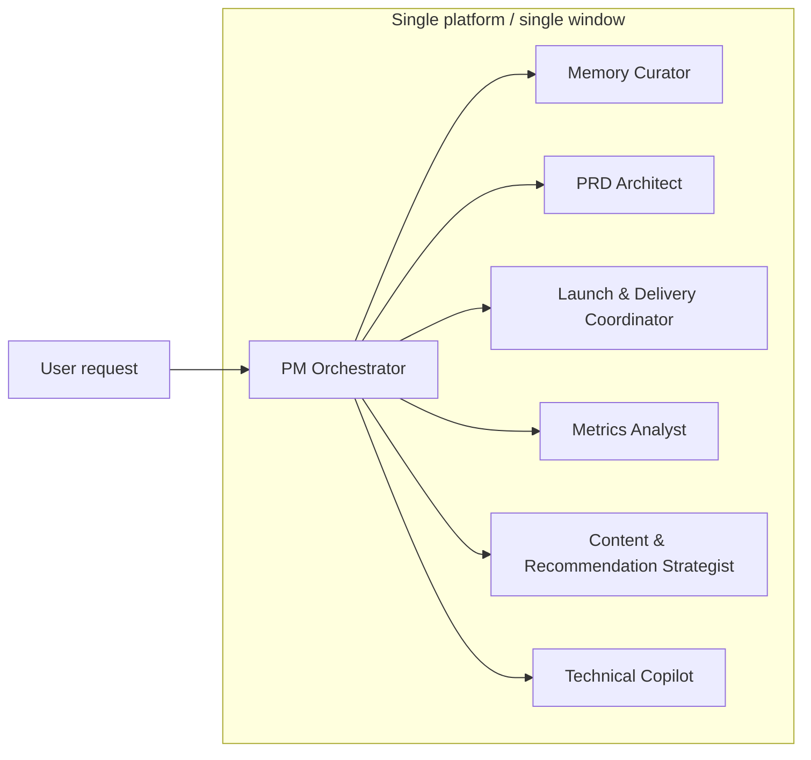
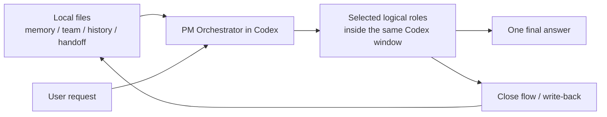
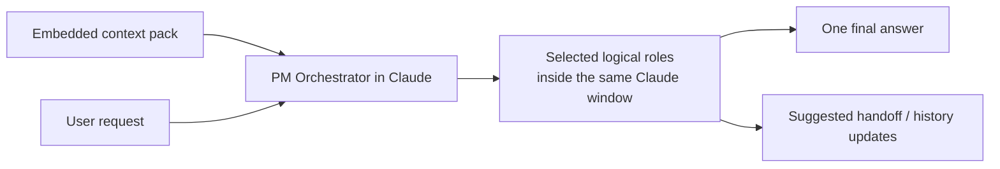
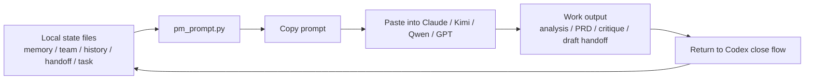

# PM Agent Cluster

This cluster is designed for an internet product manager who needs continuity across team switches, model switches, and new sessions, while still handling light technical work inside the same system.

It is inspired by department-style agent catalogs, but it stays intentionally lean. The goal is not to activate dozens of agents at once. The goal is to make routing obvious: who leads, who supports, when to use them, and what must be written back into memory.

## Design goals

- One control plane, many specialists
- Department-style agent layout
- Shared memory contract across all agents
- One lead agent plus up to two support agents by default
- Small analytics and code tasks stay inside the cluster
- Durable decisions always flow back into handoff or history

## Shared memory contract

All agents should read from the same layers when available:

1. Global memory
   Personal working style, preferences, and durable context
2. Team context
   Product, users, metrics, stakeholders, constraints, roadmap
3. History highlights
   Compressed long-term dialogue memory and durable decisions
4. Current handoff
   Latest status, next actions, blockers, changed assumptions
5. Task brief
   The goal, constraints, expected output, deadline, and success metric

## Operating model

- Every new request starts with `PM Orchestrator`
- `Memory Curator` is mandatory for resume, switch, and close flows
- Default routing is one lead agent plus up to two support agents
- Do not activate the full roster unless the work really needs it
- Any new durable decision, commitment, or process learning should end with a memory update

## Execution scenarios

### Scenario 1: all work stays inside one platform

Current baseline does not automatically dispatch work across multiple models. Inside one platform, the cluster works as one window with one active model and multiple logical roles.

#### 1A. All inside Codex

Meaning:

- one Codex window
- one active model
- many logical roles
- Codex can usually read local files directly
- Codex can usually update local files during close

#### 1B. All inside Claude

Meaning:

- one Claude window
- one active model
- many logical roles
- Claude continues from pasted context, not from direct local file access
- Claude can suggest updates, but Codex is still the preferred place to write back local files

### Scenario 2: cross-platform continuation

Current baseline also does not auto-call another platform. Cross-platform continuity happens through shared state files plus one-click prompt generation.

Meaning:

- local files stay the source of truth
- other platforms receive embedded context, not hidden file access
- cross-platform continuation is manual or semi-manual in the current baseline
- the preferred closing loop is still: return to Codex and write back durable updates

### What is not implemented yet

- no automatic multi-model routing such as `GPT-5.4 for planning -> Claude for critique -> Codex for write-back`
- no platform-to-platform direct calling
- no always-on background swarm

That is a possible phase-two architecture, but it needs a wrapper or router layer.

## Department view

### Control plane

| Agent | Specialty | When to use | Typical output | Reads |
| --- | --- | --- | --- | --- |
| PM Orchestrator | task framing, routing, synthesis, final judgement | any new request, ambiguous work, multi-step work, cross-agent coordination | execution plan, routed workflow, final synthesis | all layers |
| Memory Curator | continuity, context hygiene, handoff and history updates | resume work, switch teams, switch models, close a session, update durable context | handoff update, history update, missing-context list, continuity summary | all layers |

### Product department

| Agent | Specialty | When to use | Typical output | Reads |
| --- | --- | --- | --- | --- |
| PRD Architect | problem framing, scope writing, acceptance definition, edge-case handling | new features, iteration specs, requirement docs, redesign scope | PRD, user stories, acceptance criteria, edge cases | team, task |
| Prioritization Planner | sequencing, tradeoff framing, roadmap sorting | backlog sorting, sprint planning, scope cuts, stakeholder tradeoff review | ranked options, rationale, sequencing proposal | team, handoff, task |
| Launch & Delivery Coordinator | launch readiness, dependency tracking, release risk, milestone alignment | iOS/Android/Web launch prep, release follow-up, cross-team execution risk | launch checklist, risk register, owner matrix, milestone plan | team, handoff, task |

### Insight department

| Agent | Specialty | When to use | Typical output | Reads |
| --- | --- | --- | --- | --- |
| Insight Synthesizer | competitor scan, feedback clustering, market and user signal synthesis | competitor teardown, app reviews, support logs, interview notes, Discord or email feedback | insight brief, pain-point clusters, opportunity map, evidence summary | global, team, task |
| Metrics Analyst | KPI tree, funnel diagnosis, metric reading, instrumentation gaps | retention issues, upload or publish funnel questions, playback metrics, KPI review | KPI diagnosis, hypotheses, metric definitions, tracking gaps | team, task |
| Content & Recommendation Strategist | content supply-demand loop design, search and recommendation strategy, content taxonomy | recommendation tuning, hashtag strategy, search optimization, creator-consumer loop design, distribution issues | content strategy memo, ranking hypotheses, taxonomy proposals, recommendation actions | team, task |

### Experience and growth department

| Agent | Specialty | When to use | Typical output | Reads |
| --- | --- | --- | --- | --- |
| UX Reviewer | flow critique, interaction review, IA, copy, usability risk | onboarding, upload flow, player flow, search flow, empty states, UX polish review | UX risk list, flow improvements, copy fixes | team, task |
| Experiment Designer | A/B planning, learning agenda, growth lever design | activation work, retention experiments, conversion experiments, feature validation | experiment plan, variants, guardrails, success criteria | team, task |
| ASO & Growth Strategist | app store positioning, listing optimization, launch channel fit | iOS or Android launch, discoverability work, store conversion optimization | ASO checklist, metadata ideas, store experiments, launch recommendations | team, task |

### Technical support department

| Agent | Specialty | When to use | Typical output | Reads |
| --- | --- | --- | --- | --- |
| Technical Copilot | SQL, scripts, instrumentation, API thinking, implementation review, light code | tracking design, data pulls, API review, small scripts, technical validation, small code tasks | SQL, scripts, technical notes, implementation checklist | team, task |

## Recommended starter cluster

Do not start with the full department view active. For your current context, the best default cluster is:

- PM Orchestrator
- Memory Curator
- PRD Architect
- Launch & Delivery Coordinator
- Insight Synthesizer
- Metrics Analyst
- Content & Recommendation Strategist
- Technical Copilot

Add the rest only when the work clearly justifies them:

- add `Prioritization Planner` when backlog tradeoffs need explicit ranking or stakeholder negotiation
- add `UX Reviewer` when flow quality, IA, or copy is under review
- add `Experiment Designer` when you are running deliberate growth or learning experiments
- add `ASO & Growth Strategist` when store listing and app discoverability become active workstreams

## Routing rules

### Rule 1

Every request starts with `PM Orchestrator`. It decides:

- whether the task is single-agent or multi-agent
- which agent leads
- which support agents, if any, should join
- what memory layers must be read first

### Rule 2

Any request that mentions `continue`, `resume`, `handoff`, `switch team`, `switch model`, `pick up where we left off`, or `what changed` must also invoke `Memory Curator`.

### Rule 3

Any request about launch, release timing, blockers, dependencies, milestones, or cross-team follow-up should bring in `Launch & Delivery Coordinator`.

### Rule 4

Any request about recommendation, search, content strategy, hashtag strategy, creator-consumer loops, or distribution efficiency should bring in `Content & Recommendation Strategist`.

### Rule 5

Any request about retention, playback, upload funnel, publish funnel, KPI movement, or instrumentation should bring in `Metrics Analyst`.

### Rule 6

Light code or SQL tasks should only happen after the product intent is explicit. In practice:

- `PM Orchestrator` or `PRD Architect` defines scope
- `Technical Copilot` validates or implements the small technical task
- `Launch & Delivery Coordinator` records the result if it affects execution

### Rule 7

Any request that produces a new product decision, roadmap change, metric definition, launch commitment, or platform lesson must end with a `Memory Curator` update.

## Standard workflows

### New feature definition

1. PM Orchestrator
2. PRD Architect
3. Technical Copilot
4. Launch & Delivery Coordinator
5. Memory Curator

Use for new features, redesigns, or scope definition that need execution alignment.

### Recommendation or content iteration

1. Insight Synthesizer
2. Metrics Analyst
3. Content & Recommendation Strategist
4. PRD Architect
5. Memory Curator

Use for search and recommendation tuning, hashtag strategy, creator supply issues, content distribution, or consumption quality improvements.

### Launch readiness

1. Launch & Delivery Coordinator
2. Metrics Analyst
3. Technical Copilot
4. PM Orchestrator
5. Memory Curator

Use for iOS, Android, or Web release readiness, milestone tracking, blocker clearing, and risk control.

### Feedback to roadmap

1. Insight Synthesizer
2. Metrics Analyst
3. Prioritization Planner
4. PM Orchestrator
5. Memory Curator

Use for backlog reshaping, release re-planning, or turning user signals into product priorities.

### Cross-team or cross-model continuation

1. Memory Curator
2. PM Orchestrator

Use when you change teams, models, workspaces, or open a new thread and need fast continuity.

### Optional growth cycle

1. Metrics Analyst
2. Experiment Designer
3. ASO & Growth Strategist
4. PM Orchestrator

Use for activation, conversion, app store discoverability, or structured growth testing.

## Standard input packet

Every substantial request should provide or infer:

- objective
- background
- target user
- product stage or funnel stage
- success metric
- deadline or cadence
- constraints
- source materials
- desired output format

If the packet is incomplete, `PM Orchestrator` should state assumptions explicitly instead of waiting, unless the missing information is high risk.

## Standard output packet

Every substantial output should include:

- lead agent
- support agents
- conclusion
- assumptions
- open questions
- next actions
- memory updates required

This keeps routing, synthesis, and handoff cheap.

## Suggested default behavior

When you open a new session, ask the system to:

1. read global memory
2. read current team context
3. read history highlights
4. read current handoff
5. classify the request
6. select the lead agent and optional support agents
7. answer in the output packet structure

In Codex, this can happen from local files. In other clients, the same logic should run from the embedded context pack.

## Scope boundary

This cluster is optimized for:

- internet product management
- multi-platform launch work
- recommendation and content strategy work
- research and synthesis
- strategy and prioritization
- PRD and delivery coordination
- small analytics and technical tasks

It is not optimized for:

- heavy software implementation
- deep data science work
- pixel-perfect design production
- full-time channel operations or social media execution

Those should be escalated into dedicated workflows when needed.
