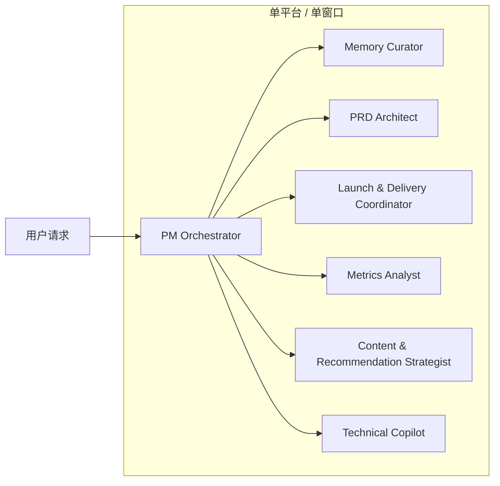
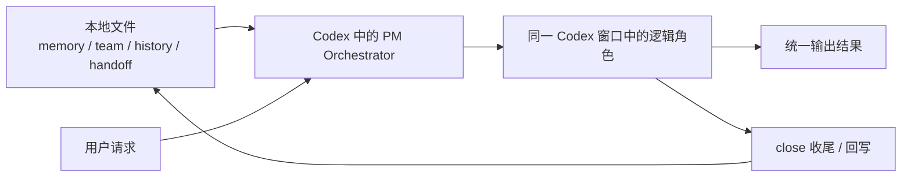
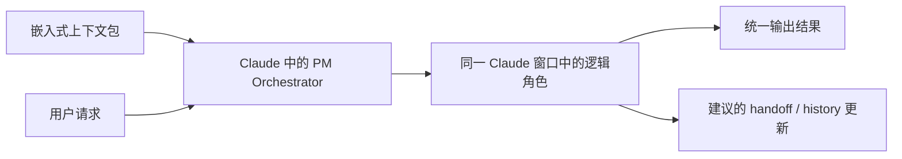
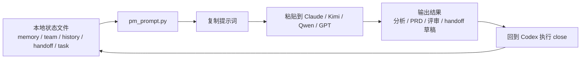

# PM Agent 集群设计

[English](pm-agent-cluster.md) | [简体中文](pm-agent-cluster.zh-CN.md)

这份文档是给产品经理看的 agent 集群设计说明。

可以把它理解成一套“小型 AI 组织架构”：

- 有控制层，负责判断任务和路由
- 有产品层，负责需求、优先级、上线推进
- 有洞察层，负责竞品、反馈、指标、推荐策略
- 有技术支持层，负责轻量 SQL、脚本、埋点和技术校验

它参考了“部门式智能体目录”的思路，但不会默认一次性开很多角色。目标不是热闹，而是高效。

## 设计目标

- 一个控制平面，多个专业角色
- 保持像“部门目录”一样清晰
- 所有角色共享同一套记忆契约
- 默认一件事只启用一个主角色，加最多两个辅助角色
- 轻量数据和技术任务仍放在同一套系统里处理
- 所有长期有价值的结论最终要回写到 `handoff` 或 `history-highlights`

## 共享记忆契约

所有角色在需要时都应读取同一套上下文层：

1. `Global memory`
   你的长期身份、工作方式、偏好
2. `Team context`
   当前业务团队、产品、用户、指标、干系人、路线图
3. `History highlights`
   压缩后的长期历史精华和已确认决策
4. `Current handoff`
   最近做到哪、下一步是什么、阻塞和风险是什么
5. `Task brief`
   当前任务目标、约束、截止时间、成功标准

## 运行方式

- 所有新请求先经过 `PM Orchestrator`
- 任何恢复、续接、换 team、换模型、收尾，都必须带 `Memory Curator`
- 默认是“一个主角色 + 最多两个辅助角色”
- 只有工作真的复杂时才扩大角色范围
- 任何新的长期结论、承诺、平台经验，都要回写记忆层

## 执行场景图

### 场景 1：全部在一个平台里完成

当前 baseline 还不支持“自动把不同角色分发给不同模型”。  
在单平台内，真实运行方式是：

- 一个窗口
- 一个当前模型
- 多个逻辑角色

#### 1A. 全部在 Codex 里

这表示：

- 只有一个 Codex 窗口
- 只有一个当前模型
- 多个角色只是“视角切换”，不是多个独立窗口
- Codex 通常可以直接读取本地文件
- Codex 也更适合做 `close` 和本地回写

#### 1B. 全部在 Claude 里

这表示：

- 只有一个 Claude 窗口
- 只有一个当前模型
- 也是多个逻辑角色，不是多窗口群聊
- Claude 当前 baseline 默认不能直接读你本机文件
- Claude 是基于你贴进去的上下文包继续工作
- 真正的本地回写仍然更推荐回到 Codex 执行

### 场景 2：跨平台续接

当前 baseline 也还不支持“平台自动调用平台”。  
跨平台的真实运行方式是：

- 本地状态文件仍是真相源
- 用脚本生成恢复提示词
- 把提示词贴到目标平台
- 做完后回到 Codex 收尾

这表示：

- 外部平台拿到的是嵌入式上下文，不是隐藏的文件访问权限
- 跨平台连续性目前是手动或半手动，而不是全自动调度
- 最稳的闭环仍然是：外部平台做工作，Codex 回写本地状态

### 当前还没有实现的能力

- 还没有自动多模型路由  
  例如：`GPT-5.4 负责计划 -> Claude 负责批判 -> Codex 负责回写`
- 还没有平台到平台的自动调用
- 还没有常驻后台 agent swarm

这些都属于 phase two，需要 wrapper 或 router 层。

## 当前模式 vs 下一阶段模式

| 维度 | 当前模式 | 下一阶段模式 |
| --- | --- | --- |
| 集群形态 | 逻辑集群 | 真实编排集群 |
| 窗口形态 | 一个窗口内的多角色视角 | 多模型、多角色可分发 |
| 模型调度 | 不自动调度不同模型 | 可按角色自动路由到不同模型 |
| 跨平台方式 | 手动或半手动粘贴上下文包 | wrapper / router 自动注入上下文 |
| 文件读取 | Codex 可直接读本地文件，外部客户端默认不能 | 外部客户端也可通过连接层间接读文件 |
| 状态回写 | 优先回到 Codex 做 close | 可由编排层统一回写 |
| 自动化程度 | baseline，可用但偏轻量 | 更自动、更像真实多 agent 系统 |
| 适用阶段 | 现在就能稳定用 | 等手动切换成本明显上升后再做 |

当前这版已经足够支撑：

- 换 team
- 换线程
- 换模型
- 低成本续接

下一阶段主要解决的不是“能不能用”，而是“能不能更自动”。

## 部门视图

### 控制层

| 智能体 | 专长 | 何时使用 | 典型输出 | 读取内容 |
| --- | --- | --- | --- | --- |
| PM Orchestrator | 任务判断、路由、综合判断、最终收束 | 任何新请求、模糊任务、多步骤任务 | 执行路径、角色分工、最终综合结论 | 全部层 |
| Memory Curator | 连续性、上下文卫生、交接与历史沉淀 | 恢复、续接、换 team、换模型、收尾 | handoff 更新、history 更新、缺失项、连续性摘要 | 全部层 |

### 产品层

| 智能体 | 专长 | 何时使用 | 典型输出 | 读取内容 |
| --- | --- | --- | --- | --- |
| PRD Architect | 需求定义、范围拆解、验收标准、边界情况 | 新功能、需求文档、版本迭代、改版 | PRD、用户故事、验收标准、边界条件 | team, task |
| Prioritization Planner | 优先级排序、取舍、排期思考 | backlog 排序、scope cut、资源有限时的取舍 | 优先级列表、排序理由、建议顺序 | team, handoff, task |
| Launch & Delivery Coordinator | 上线准备、依赖管理、里程碑推进、风险控制 | iOS/Android/Web 上线、跨团队推进、发布准备 | 上线清单、风险列表、owner 表、里程碑计划 | team, handoff, task |

### 洞察层

| 智能体 | 专长 | 何时使用 | 典型输出 | 读取内容 |
| --- | --- | --- | --- | --- |
| Insight Synthesizer | 竞品、反馈、市场和用户信号整理 | 竞品分析、商店评论、Discord、邮件、访谈、用户反馈 | 洞察简报、痛点聚类、机会点、证据摘要 | global, team, task |
| Metrics Analyst | 指标树、漏斗诊断、埋点缺口、数据解释 | 留存问题、上传/发布成功率、播放时长、KPI 变化 | 指标诊断、假设、指标定义、追踪缺口 | team, task |
| Content & Recommendation Strategist | 内容策略、推荐、搜索、标签体系、供需循环 | 推荐优化、搜索策略、hashtag、分发效率、创作者-消费者循环 | 内容策略建议、排序假设、推荐动作、标签方案 | team, task |

### 体验与增长层

| 智能体 | 专长 | 何时使用 | 典型输出 | 读取内容 |
| --- | --- | --- | --- | --- |
| UX Reviewer | 流程审查、交互、信息架构、文案 | onboarding、上传流程、播放器流程、搜索流程、空状态 | UX 风险清单、流程改进、文案建议 | team, task |
| Experiment Designer | AB 实验、增长学习、验证设计 | 激活、留存、转化优化、实验规划 | 实验方案、变量设计、护栏指标、成功标准 | team, task |
| ASO & Growth Strategist | 应用商店优化、可发现性、商店转化 | iOS/Android 上线、商店页优化、商店转化提升 | ASO 清单、标题描述建议、商店实验建议 | team, task |

### 技术支持层

| 智能体 | 专长 | 何时使用 | 典型输出 | 读取内容 |
| --- | --- | --- | --- | --- |
| Technical Copilot | SQL、脚本、埋点、API 思考、轻代码任务 | 数据拉取、埋点设计、API 评审、小脚本、小代码改动 | SQL、脚本、技术说明、实现检查单 | team, task |

## 建议默认编制

不要一上来就把所有角色全开。  
对你当前的真实场景，最适合常驻的核心角色是：

- `PM Orchestrator`
- `Memory Curator`
- `PRD Architect`
- `Launch & Delivery Coordinator`
- `Insight Synthesizer`
- `Metrics Analyst`
- `Content & Recommendation Strategist`
- `Technical Copilot`

按需再启用的角色：

- `Prioritization Planner`
  - 当你要做明确的优先级排序、scope cut、路线图取舍时再启用
- `UX Reviewer`
  - 当你要做交互流程、文案、信息架构评审时再启用
- `Experiment Designer`
  - 当你要做结构化增长实验时再启用
- `ASO & Growth Strategist`
  - 当 iOS/Android 商店优化与可发现性成为重点时再启用

## 路由规则

### 规则 1

所有请求先经过 `PM Orchestrator`。它负责判断：

- 这是单角色还是多角色任务
- 应该由谁主导
- 哪些辅助角色需要加入
- 先读哪些记忆层

### 规则 2

任何出现这些意图的请求，都必须带上 `Memory Curator`：

- `continue`
- `resume`
- `handoff`
- `switch team`
- `switch model`
- `pick up where we left off`
- `what changed`

### 规则 3

任何和这些主题有关的请求，优先拉 `Launch & Delivery Coordinator`：

- 上线
- 发布时间
- 依赖项
- blocker
- milestone
- 跨团队推进

### 规则 4

任何和这些主题有关的请求，优先拉 `Content & Recommendation Strategist`：

- 推荐
- 搜索
- 内容策略
- hashtag
- 创作者-消费者循环
- 分发效率

### 规则 5

任何和这些主题有关的请求，优先拉 `Metrics Analyst`：

- 留存
- 播放时长
- 上传漏斗
- 发布漏斗
- KPI 波动
- 埋点与指标定义

### 规则 6

轻量 SQL 或代码任务必须在产品意图明确之后再做。  
实际顺序一般是：

- `PM Orchestrator` 或 `PRD Architect` 先定义范围
- `Technical Copilot` 再验证或执行小技术任务
- 如果影响上线或节奏，再由 `Launch & Delivery Coordinator` 记录到执行面

### 规则 7

任何产生了下面这些结果的任务，最后都要由 `Memory Curator` 判断是否回写：

- 新产品决策
- 路线图变化
- 指标定义变化
- 上线承诺
- 新的平台经验

## 标准工作流

### 新功能定义

1. PM Orchestrator
2. PRD Architect
3. Technical Copilot
4. Launch & Delivery Coordinator
5. Memory Curator

适用于：新功能、改版、scope 定义、需求落地前对齐。

### 推荐 / 内容策略迭代

1. Insight Synthesizer
2. Metrics Analyst
3. Content & Recommendation Strategist
4. PRD Architect
5. Memory Curator

适用于：推荐优化、搜索策略、hashtag、内容供给、内容分发和消费质量优化。

### 上线准备

1. Launch & Delivery Coordinator
2. Metrics Analyst
3. Technical Copilot
4. PM Orchestrator
5. Memory Curator

适用于：iOS、Android、Web 发布前准备，里程碑跟踪，风险清理，依赖推进。

### 反馈进入路线图

1. Insight Synthesizer
2. Metrics Analyst
3. Prioritization Planner
4. PM Orchestrator
5. Memory Curator

适用于：根据用户反馈和数据重排 backlog、做 scope 调整、改 release 计划。

### 跨 team / 跨模型 / 新线程续接

1. Memory Curator
2. PM Orchestrator

适用于：换 team、换模型、换 workspace、开新线程时快速恢复状态。

### 可选的增长实验循环

1. Metrics Analyst
2. Experiment Designer
3. ASO & Growth Strategist
4. PM Orchestrator

适用于：激活、转化、商店可发现性、结构化实验。

## 标准输入包

一个较完整的任务输入，最好至少包含这些字段：

- objective
- background
- target user
- product stage 或 funnel stage
- success metric
- deadline 或 cadence
- constraints
- source materials
- desired output format

如果缺信息，`PM Orchestrator` 默认应先明确假设，而不是直接停住等待，除非缺失内容风险很高。

## 标准输出包

一个较完整的输出，最好至少包含这些字段：

- lead agent
- support agents
- conclusion
- assumptions
- open questions
- next actions
- memory updates required

这样后续综合、续接、回写都会更便宜。

## 默认建议行为

每次开新会话时，默认让系统按这个顺序做：

1. 读取 global memory
2. 读取 current team context
3. 读取 history highlights
4. 读取 current handoff
5. 判断请求类型
6. 选择主角色和辅助角色
7. 按标准输出包回答

在 Codex 里，这通常可以直接从本地文件完成。  
在其他客户端里，同样的逻辑应该基于嵌入式上下文包执行。

## 适用边界

这套集群最适合：

- 互联网产品管理
- 多端上线推进
- 推荐和内容策略
- 研究和洞察整理
- 策略与优先级判断
- PRD 与交付协调
- 轻量数据与技术任务

这套集群不适合：

- 重型软件开发
- 深度数据科学建模
- 像素级设计产出
- 全职社媒运营或渠道执行

这些场景更适合再拆到专门的工作流。
